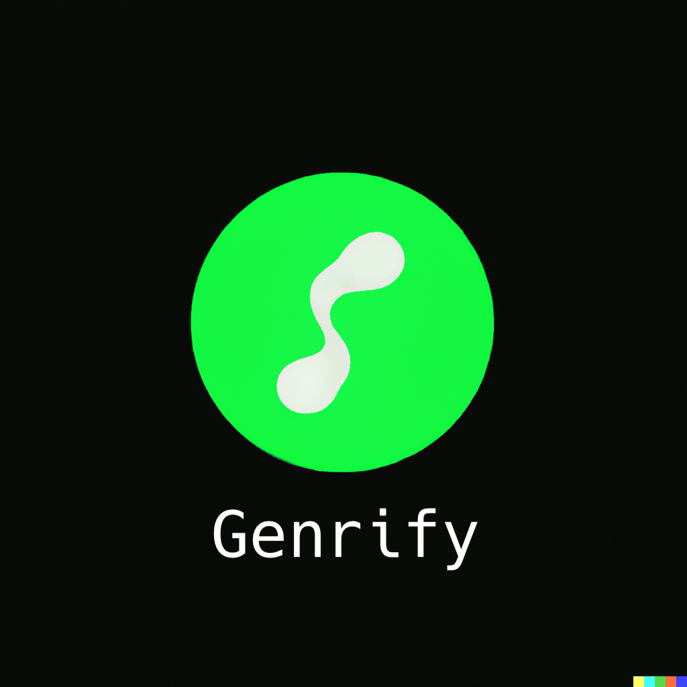

  
  <h1>Genrify</h1>
  
  

    Free tool to get mp3 genre data using Spotify API 
  

  
  
<!-- Badges -->

  
  
  
  
  
  
  
  
  
  

   
<h4>
    <a href="https://github.com/mdenitz/genrify#readme">Documentation</a>
   · 
    <a href="https://github.com/mdenitz/genrify/issues">Report Bug</a>
   · 
    <a href="https://github.com/mdenitz/genrify/issues/new">Request Feature</a>
  </h4>

<!--Description -->
## :open_book: Description
**Genrify is a tool to add genre metadata to your mp3 files.The genre is acquired by using the mp3 file's artist metadata to search for the respective genre.**   

* The script will utilize your Spotify app credentials stored in a `config.py` file within the project directory. 
* You have the option of using simple auth without spotify credentials
* You will provide the path to a folder that contains mp3 files for genrify to process.  
* You have the option of overwriting files that contain existing genres as well as the option to specify the number of mp3 files that will be processed.
<!-- Getting Started -->
## 	:toolbox: Getting Started

<!-- Prerequisites -->
### :bangbang: Prerequisites

Please navigate to https://developer.spotify.com/dashboard and create app to acquire credentials  
Have Client ID and Client Secret ready before running script
<!-- Run Locally -->
### :running: Run Locally

Clone the project

`$ git clone https://github.com/mdenitz/genrify.git`

<!-- Installation -->
### :gear: Installation

Go to the project directory

`$ cd genrify `

Install desired packages using PIP

`$ pip install -r requirements.txt`

Run the script

`$ python3 genrify.py`

## :closed_lock_with_key: Spotify Credentials 

You will be first prompted to choose an easy authentication method or client credential method.  
The easy method:  
Simple. API Key retrieved for you.

Spotify client credential method:  
If you do not have a `config.py` file upon initial run you will be prompted to create one.  

Inside `config.py` please insert the following if script doesn't succesfully create one for you: 

- `client_id`: The spotify Client ID
- `client_secret`:The Client Secret 

You can alternatively use environment variables for your credentials. The script will check those as well.

## :open_file_folder: Getting Folder Path

The script will ask you for a folder that contains mp3s to be converted. Please get the folder path.

You can either:

1. `cd` into the folder directory and `pwd` once inside to get path. 
2. Drag the folder into the terminal window when prompted to provide the folder path.

Does not currently check in nested folders so whatever mp3s you have placed in the folder will be processed.

## Troubleshooting

Within the Spotify API genres are assosciated with artists (**not with song name**) so genrify will try and get the artist metadata from the file in order to perform the search for a genre. If file does not contain an artist then this will be logged.

## :question: Why
* I built this tool because I have a old ipod classic I want to use to play music with the mp3 songs I have and don't have any playlists set up or genres set for the mp3s. 
    * The only option for listening to music was to shuffle the 1800+ songs I have.
    * I figured if I had the songs in their respective genre then that would take care of categorizing the music and essentially create smart playlists.  
    * Now that songs have genres I can select a genre I'm in the mood for and listen.

   Hopefully this tool helps someone with a similar issue.

## Support with :coffee: 

